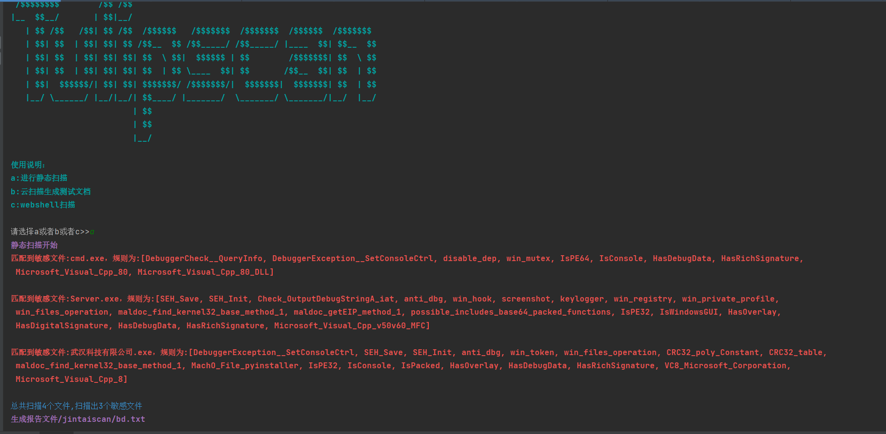
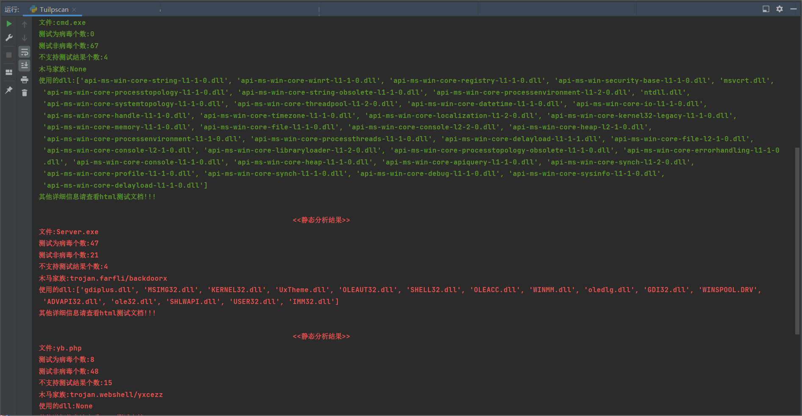
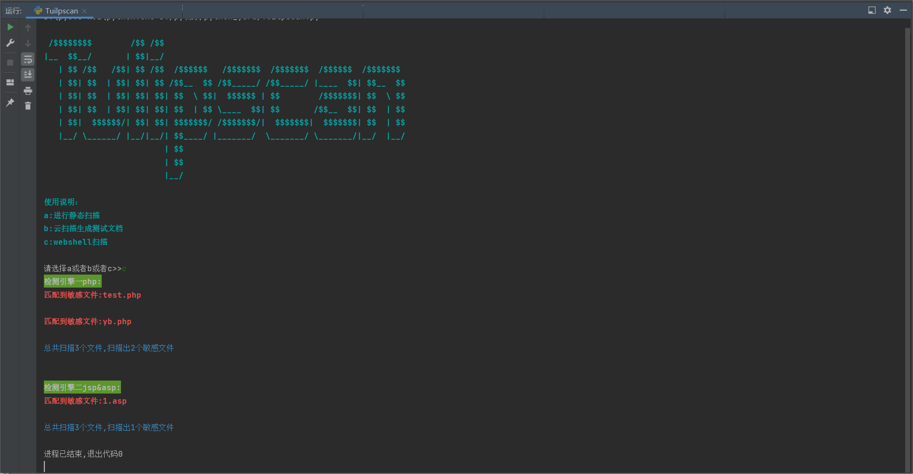
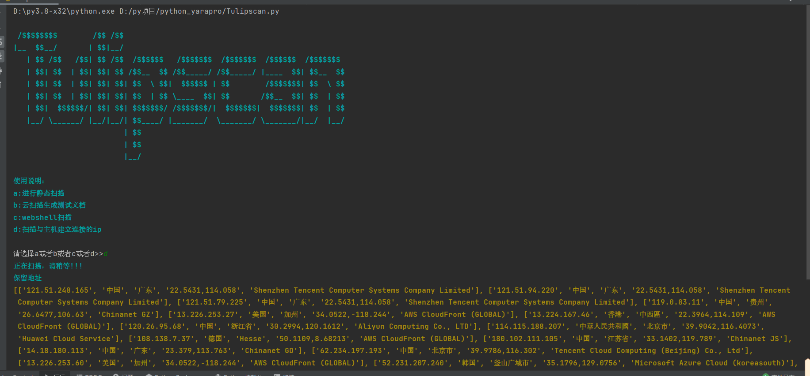
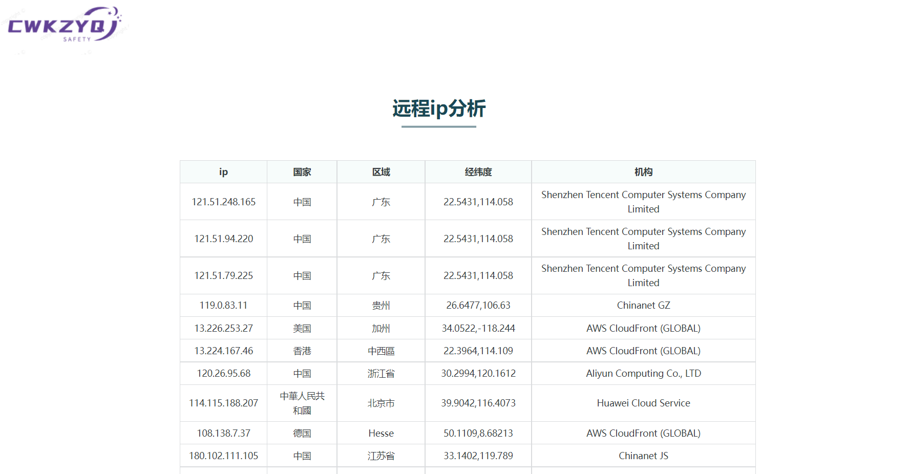
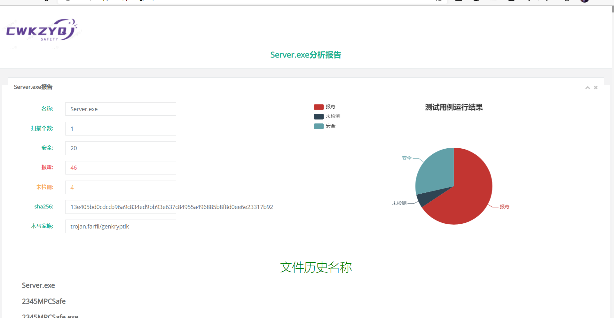
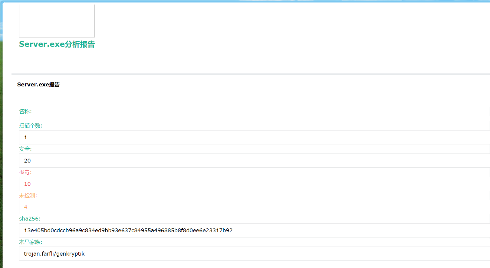

# Tulipscan开发文档

## 简介
基于python3开发(python3.8,32位)

一款检测恶意文件的扫描器，可以扫描各类恶意文件，支持静态，云扫描。

## 静态扫描

静态扫描规则为yara匹配，恶意文件的yara规则在gz目录下，webshell的yara规则在webshellgz目录下，可以自己添加

## 云扫描
云扫描相关配置位于config目录下，该目录下有两个配置文件config.json和path.json文件。正常使用只需要配置api即可

主要使用vt，根据实际情况更改运行的虚拟机，可供使用虚拟机如下(微步普通版):  

```
 Windows:
            1：win7_sp1_enx64_office2013
            2：win7_sp1_enx86_office2013
            3：win7_sp1_enx86_office2010
            4：win7_sp1_enx86_office2007
            5：win7_sp1_enx86_office2003
        Linux:
            6：ubuntu_1704_x64
            7：centos_7_x64
```

云扫描使用的微步以及vt和大圣云(代码写了，暂时没有加入)平台，获取分析信息，报告位于html目录下。

扫描结束会返回软件的基本信息，包括是病毒的话吗，属于扫描家族，报毒个数，使用的dll等等。
## 消息推送
微信或者邮箱推送扫描结果,由于云平台扫描的时间不等，所以可以放后台扫描，扫描报告通过qq邮件发送通知，可以快速查找恶意文件，以及简单的分析。

## 使用

### 安装第三方库
```
-i 镜像地址
eg：pip install -r requirements.txt -i https://pypi.tuna.tsinghua.edu.cn/simple
pip install -r requirements.txt
```
### 配置config下的api
文件位于config下的config.json，可以在各平台免费申请

qq邮箱秘钥配置，以及发送到的邮件进行配置

### 使用须知
扫描webshell文件，请将shell文件放到webshell目录下  
扫描其他的恶意文件，请放到yangben目录下

### 扩展
可以增加yara规则，增加扫描规则  
yara规则编写参考:  
https://zhuanlan.zhihu.com/p/361359544

## 使用示例

直接运行:

```bash
python Tulipscan.py
```


1.静态扫描：



2.云扫描



3.webshell静态扫描



5.ip扫描





5.报告显示



5.邮箱提示



## 后续推出免杀框架版本
免杀平台，后续补充。

## 参考

yara规则参考于：  
https://github.com/Yara-Rules/rules
云扫描平台：  
virustotal：  
https://www.virustotal.com/gui/home/upload  
微步:  
https://s.threatbook.cn/  
大圣云沙箱：  
https://sandbox.riskivy.com/mac-cloud

